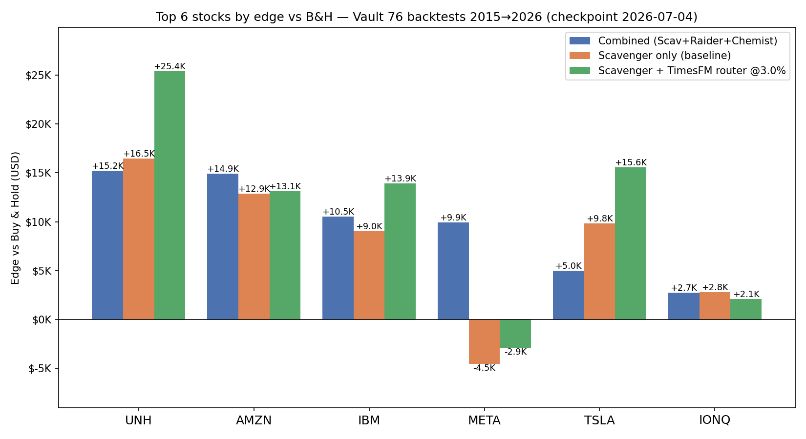

# Schwab Trading Automation

Pullback-in-trend strategy for US stocks via the Charles Schwab API,
with Claude Code as the live signal verification layer.

---

## Strategy

**Long (BUY) signal conditions — all must be true:**
1. EMA20 > EMA50, price > EMA50, EMA50 rising (confirmed uptrend)
2. RSI dipped into 28–50 zone within last 5 bars (pullback occurred)
3. RSI recovering + green candle + price above EMA20 + volume > 0.9× avg (entry signal)

**Exit rules:**
- Target: entry + 5× ATR (~20%)
- Stop: entry − 2× ATR (~8%)
- Also exit if EMA20 crosses below EMA50 (trend ended)
- Max hold: 30 days

---

## Files

| File | Purpose |
|------|---------|
| `trend_scanner.py` | Core signal logic — `detect_trend`, `detect_pullback`, `detect_entry` |
| `backtest_strategy.py` | Walk-forward backtest on historical NVDA data |
| `live_scanner.py` | **Live loop** — runs in tmux, pauses on signals for Claude verification |
| `options_ledger.py` | Paper options lifecycle — expiry, assignment, covered calls, adaptive early exit; wheel holdings in `data/paper_wheel_holdings.json` |
| `chain_quotes.py` | Re-quotes Scavenger signals against the real Schwab chain (mid price, real IV/delta); falls back to Black-Scholes |
| `assignment_risk.py` | LGBM advisory — per-symbol P(>5% drop within 30 trading days), shown to the LLM, never gates |
| `compare_wheel_versions.py` | Backtest: puts-only-hold-to-expiry (old live behavior) vs full wheel (current) |
| `signal_verifier.py` | Data utilities — VIX, earnings proximity, headlines (used by Claude during live review) |
| `daily_signal.py` | One-shot daily scan + Slack notification |
| `market_intel.py` | News sentiment + technical analysis helpers |
| `nvda_trader.py` | Schwab API wrappers — auth, price history, order placement |
| `schwab_account.py` | Account info queries |

**Test files:** `test_trend_scanner.py`, `test_backtest_strategy.py`, `test_signal_verifier.py`

---

## Live Trading Workflow (via `/schwab` skill)

### One-command start

In Claude Code CLI:
```
/schwab start    # launches live_scanner.py in schwab-screen tmux
/schwab watch    # Claude enters monitoring loop, auto-approves or skips signals
/schwab stop     # kills the session
```

The scanner exits automatically at 4pm ET (market close). No need to stop it manually.

### Manual start (without skill)

```bash
tmux new-session -d -s schwab-screen
tmux send-keys -t schwab-screen \
  '/Users/lincai/anaconda3/envs/gold-finger/bin/python schwab/live_scanner.py' Enter
tmux attach -t schwab-screen
```

### Claude Code monitoring

When watching (`/schwab watch`), Claude:

Claude polls the pane every ~4.5 min (270s — keeps prompt cache warm). When it sees `===SIGNAL_START===`, it:
1. Reads signal details (symbol, entry, RSI, ADX, etc.)
2. Calls `signal_verifier.gather_signal_context()` for VIX + earnings + headlines
3. Uses its installed trading skills + web search to analyze macro conditions
4. Sends `y` (approve) or `n` (skip) via `tmux send-keys -t schwab-screen`

### 3. What Claude checks before approving

- **VIX ≥ 30** → auto-reject (extreme fear)
- **Earnings within 5 days** → auto-reject (high event risk)
- **Catastrophic news** → reject (factory fire, sanctions, crisis)
- **Elevated VIX 20–30** → approve with caution note
- **Routine news / analyst commentary** → approve

### 4. How to watch manually (if Claude isn't watching)

```bash
tmux attach -t schwab-screen
# When you see "Proceed? [y/N]:", type y or n
```

---

## One-Shot Daily Scan (no tmux needed)

```bash
/Users/lincai/anaconda3/envs/gold-finger/bin/python schwab/daily_signal.py
```

Scans watchlist, runs macro verification gate for each BUY signal, sends Slack notification.

---

## Backtest

```bash
# Uses saved data/nvda_history.csv
/Users/lincai/anaconda3/envs/gold-finger/bin/python schwab/backtest_strategy.py

# Re-fetch from Schwab first
/Users/lincai/anaconda3/envs/gold-finger/bin/python schwab/backtest_strategy.py --fetch
```

---

## Signal Verifier CLI

Quick data check for any symbol:

```bash
/Users/lincai/anaconda3/envs/gold-finger/bin/python schwab/signal_verifier.py NVDA
```

Shows: VIX level, earnings proximity, recent headlines, any auto-block conditions.

---

## Environment Setup

**Conda env:** `gold-finger` at `/Users/lincai/anaconda3/envs/gold-finger/`

**Secrets in `.env`:**
```
SCHWAB_CLIENT_ID=...
SCHWAB_CLIENT_SECRET=...
SLACK_WEBHOOK_URL=...
FINNHUB_API_KEY=...      # optional — headlines fallback to RSS if missing
```

**Token file:** `schwab/schwab_token.json` — created on first OAuth login, not in git.

**First-time auth:**
```bash
/Users/lincai/anaconda3/envs/gold-finger/bin/python schwab/nvda_trader.py --auth
```

---

## Token Budget (one trading day)

| Mode | Interval | Cache | Wakeups/day | Approx tokens |
|------|----------|-------|-------------|---------------|
| Watch (no signals) | 270s (4.5 min) | warm ✓ | 86 | ~100K new tokens |
| Watch (no signals) | 600s (10 min) | cold ✗ | 39 | ~2M+ tokens |
| Per signal analysis | — | — | rare | ~2–5K extra |

**Key insight:** 270s keeps the 5-min prompt cache warm → each check only pays for
the *new* pane content (~1K tokens), not the full conversation context. At 10 min
the cache expires and you re-read everything each time — much more expensive.

Stick with `270s` intervals. On a day with 0 signals the cost is minimal.

---

## Run Tests

```bash
/Users/lincai/anaconda3/envs/gold-finger/bin/python -m pytest schwab/ -v
```

---

## Watchlist

```
NVDA, AMD, TSLA, AAPL, AMZN, META, MSFT, GOOGL, TQQQ, SOXL
```

Edit `WATCHLIST` in `live_scanner.py` or `daily_signal.py` to change.

---

## Top candidates & capital sizing (checkpoint 2026-07-04)



Top 6 symbols by combined edge vs B&H (2015→2026): UNH, AMZN, IBM, META,
TSLA, IONQ. Note the backtests assume **100 shares / 1 contract per trade,
no compounding** — dollar edges rank per-symbol strategy quality; they are
NOT account returns and have no relation to the $30K paper portfolio.

Wheeling the **top 3** needs one contract of cash-secured collateral each
(at 2026-06-26 closes, 5% OTM strikes):

| Symbol | Close   | Strike | Collateral |
|--------|--------:|-------:|-----------:|
| UNH    | $427.89 |  ~$406 |    $40,600 |
| AMZN   | $232.69 |  ~$221 |    $22,100 |
| IBM    | $271.63 |  ~$258 |    $25,800 |
| all 3  |         |        |  **$88,500** |

**Reasonable capital: ~$95-100K** (collateral + ~10% cushion for
assignments and same-symbol stacking). Smaller tiers: ~$55K → AMZN+IBM;
~$30K → one name at a time (why the $30K paper account trades KO/PG —
the budget check auto-skips big names). A $10K account fits none of the
top 3 (KO ~$7.7K / IONQ ~$5.1K only); the router's HOLD_SHARES side is
the accessible way into expensive names. Income scale at full size:
~1-1.5% of collateral per monthly cycle ≈ $900-1,300/month gross.

---

## Signal Flow Diagram

```
live_scanner.py (tmux: schwab-screen)
  │
  ├── every 5 min during market hours (9am–4pm ET)
  │   scan WATCHLIST via Schwab API
  │
  ├── BUY signal found?
  │   ├── print ===SIGNAL_START=== block
  │   └── wait for input: "Proceed? [y/N]:"
  │
Claude Code (watching pane)
  │
  ├── sees ===SIGNAL_START===
  ├── gather_signal_context(symbol) → VIX + earnings + headlines
  ├── analyze with skills (market_intel, web search, news)
  ├── hard-block? → send "n"
  └── all clear? → send "y" + reasoning printed to Claude terminal
  │
live_scanner.py
  ├── "y" → print ===APPROVED=== + order suggestion
  └── "n" → print ===SKIPPED===
```

---

## Plan — next experiments

1. **TimesFM second opinion next to Kronos** — DONE (timesfm_advisor.py).
   Zero-shot 30-day SMA5 forecast per symbol cached at scanner startup
   (same pattern as the Kronos cache), attached to all signals as
   `timesfm_30d_pct`. Kronos + TimesFM agreeing bearish is a stronger
   skip signal than either alone.

2. **Backtest the advisories as mechanical gates.** The walk-forward
   backtests never consume the LGBM or TimesFM advisories — they only
   inform the live LLM overseer, so their value is currently unmeasured
   (and LGBM holdout AUCs of 0.44–0.59 on real history are a warning
   sign). Experiments, each vs the 2026-07-04 checkpoint baseline
   (-$15,506, 8/18):
   - LGBM gate: in `backtest_scavenger.py`, skip SELL_PUT entries when a
     walk-forward `assign_risk_pct` > 60% (refit the per-symbol model
     periodically inside the loop, no lookahead). Minutes of runtime.
   - TimesFM gate: skip SELL_PUT when the walk-forward 30-day SMA5
     forecast < -5% (one zero-shot forecast per bar per symbol, ~52k
     forecasts batched — roughly 1-1.5h runtime). Same harness so both
     advisories are measured on equal footing.

3. **Wheel-vs-hold strategy router** — TESTED 2026-07-04, NOT DEPLOYED.
   Idea: the negative edge is concentrated in runners (AMD -$24K, MSFT
   -$14K, GOOGL -$14K scavenger-only) where covered calls cap the upside,
   so route per symbol per bar: walk-forward LGBM P(>8% rally in 30d) >= τ
   → hold 100 shares uncapped instead of wheeling (and skip covered calls
   while hot). Implemented in wheel_router.py + ROUTER_HOLD state in
   backtest_scavenger.py; experiment runner backtest_router.py; report at
   data/backtest_router_2026-07-04.txt.

   LGBM predictor result vs scavenger-only baseline edge -$46,043:
   τ=0.50 → -$58,836, τ=0.60 → -$44,621, τ=0.70 → -$47,610. Best case is
   +$1.4K (noise); per-symbol swings are huge and threshold-sensitive.
   Bottleneck is the predictor (holdout AUC ~0.5), not the routing rule.

   **TimesFM predictor result (2026-07-04): the router works.** Per-bar
   zero-shot 30d SMA5 forecast (`--predictor timesfm`, series cached in
   data/router_cache/), route when forecast >= τ%:
   τ=3.0 → **-$16,748**, τ=3.5 → -$18,785, τ=4.0 → -$20,539 — a stable
   plateau recovering $25-29K of the -$46K deficit, with broad per-symbol
   gains (UNH +$8.9K, GOOGL +$6.3K, TSLA +$5.7K, IBM +$4.9K @3.0) and
   small concentrated losses (XOM -$2.8K worst). Falls apart outside the
   band: τ=2.0 → -$58,540 (over-routing), τ=6.0 → -$43,648 (never fires).
   Adding unchanged Raider (+$8.4K) and Chemist (+$22.2K) books, the
   routed portfolio edge turns POSITIVE: ≈ +$14K vs B&H — first
   configuration to beat buy-and-hold. Reports:
   data/backtest_router_tfm_2026-07-04.txt (2/4/6 sweep),
   data/backtest_router_tfm_sweep_2026-07-04.txt (3/3.5/4/4.5).

   **2024+ validation (`--since 2024-01-01`) PASSED**
   (data/backtest_router_tfm_2024plus.txt): in the recent window the
   baseline scavenger already beats B&H (+$12,067) and the router
   roughly doubles it — τ=3.0 → +$25,775, 3.5 → +$23,687, 4.0 →
   +$21,355, beats 10/18 vs 9/18 — same plateau shape as the full
   history, few holds (0-24/symbol over 2.5y). Biggest per-symbol cost:
   TSLA +$20.2K → +$8.7K @3.0 (router exits too early on the wildest
   name); biggest wins NVDA +$8.8K, AMZN +$5.4K, IBM +$5.1K @3.0.

   Remaining caveats: (a) threshold still chosen from the same data —
   but the 3-4% plateau held in both windows; (b) TimesFM 2.5 shipped
   in 2025, so even 2024 bars may brush its pretraining window — the
   only fully clean data is live paper trading from here on; (c) no
   transaction costs on router share trades (~2-4 round trips/yr).

   **DEPLOYED to the scanner (2026-07-04), mechanical-proposes /
   LLM-disposes:** when the cached TimesFM forecast crosses τ=3.5%
   (wheel_router.ROUTER_TAU), the scanner emits HOLD_SHARES /
   RESUME_WHEEL signals; the AutoOverseer approves by default (that is
   the backtested policy) and vetoes only on context the models can't
   see (earnings/halt/macro — see OVERSEER_SYSTEM). While a hold is
   active the Scavenger is suppressed for that symbol. Hold positions
   persist in data/paper_router_holds.json; proposals dedup per
   day/symbol/action. Real mode prints the suggested share trade but
   never places automated equity orders. Vetoes land in overseer.log —
   after a few weeks of paper trading, compare LLM-mediated vs pure
   mechanical policy and keep the winner.

4. **Portfolio allocation — choosing among affordable signals.** Today
   capital is assigned first-come-first-served in WATCHLIST order: each
   signal passes the budget check alone, and the LLM approves per-signal
   without seeing competitors, so "two small caps vs one large" is never
   actually decided — list position decides. Factors a real allocator
   should weigh: capital efficiency (premium/day per collateral $ —
   backtest edge per collateral $ is AMZN ~0.67 > IBM ~0.41 > UNH ~0.37),
   edge quality (cheap ≠ good: KO is cheap and negative-edge),
   concentration and correlated-assignment risk, expiry laddering
   (small positions free capital in slices), real-chain liquidity
   (bid/ask), and a cash reserve for rolls.
   Step 1 — DONE (2026-07-04): each signal's prompt lists the scan's
   other pending candidates ("Other pending signals this scan", compact
   per-peer summary via peer_summaries()) and OVERSEER_SYSTEM has a
   "Capital allocation" section: rejecting an acceptable signal to keep
   collateral for a stronger peer is explicitly valid; prefer premium/day
   per collateral $, proven-edge names, diversification, laddering,
   real-chain quotes; keep ~10% cash reserve.
   Step 2 — ranking DEPLOYED (2026-07-04), measurement pending. New
   allocator.py orders each scan's batch deterministically: cash-freeing
   signals first (RESUME_WHEEL, covered SELL_CALL), then SELL_PUTs by
   premium/day per collateral $ halved per open position on the symbol,
   then BUY/HOLD_SHARES. live_scanner ranks the batch before the
   overseer loop, so high-efficiency candidates get first claim on cash
   instead of WATCHLIST order. Caveat: the existing backtests run each
   symbol as an independent book with no shared cash, so they cannot
   measure allocation policy — validating step 2 needs a portfolio-level
   harness (merge per-symbol signal streams under one cash constraint).
   Until then the ranking is justified by construction (dominance:
   free-cash signals cost nothing; higher premium/day per $ is strictly
   better for identical risk) and by paper trading observation.
